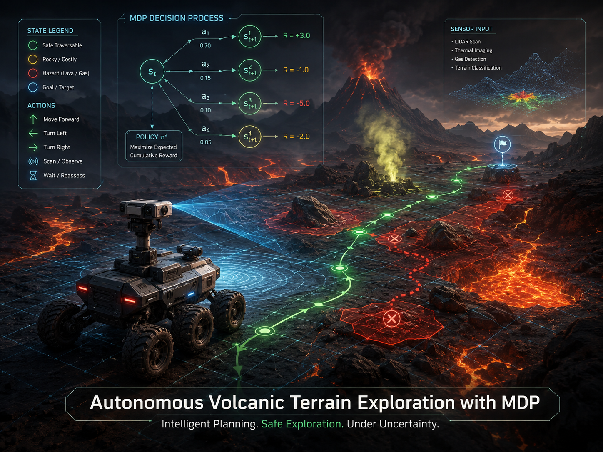

# Autonomous Volcanic Terrain Exploration Using Markov Decision Process (MDP)

## Short Overview

This repository is for a CSE 440 Artificial Intelligence semester project. The project will study how an autonomous exploration agent can navigate a hazardous volcanic terrain using a Markov Decision Process (MDP).

<p align="center">
  
</p>

<p align="center">
  <em>Project poster for the autonomous volcanic terrain exploration system.</em>
</p>

This is the initial Week 1 setup version. The current repository contains the project skeleton, configuration planning, placeholder modules, and a runnable `main.py` file. The full MDP algorithm, terrain generation, simulation, and visualization features are planned for later weeks.

## Problem Statement

Volcanic environments are dangerous, uncertain, and difficult for humans to explore directly. An autonomous agent operating in this type of environment must make decisions while considering hazards such as lava flows, craters, gas emission zones, and obstacles. At the same time, it should collect useful scientific information and return or remain connected to a base station when needed.

The problem is to design an AI-based exploration system that can decide where the agent should move in a grid-based volcanic terrain while balancing safety, exploration, and scientific reward.

## Why MDP Is Suitable

A Markov Decision Process is suitable for this project because the agent must make sequential decisions under uncertainty. Each movement action may not always lead exactly where intended because of terrain difficulty, sensor limitations, or environmental instability.

An MDP provides a structured way to represent:

- The current state of the agent.
- The possible actions available to the agent.
- The probability of reaching the next state after an action.
- The reward or penalty for entering different terrain cells.
- A policy that recommends the best action for each state.

This makes MDP a good fit for modeling volcanic terrain exploration as a decision-making problem.

## Planned AI Formulation

### States

Each state will represent the agent's position in the terrain grid. A state may later include additional information such as collected science points or hazard conditions.

### Actions

The planned actions are movement choices such as moving up, down, left, or right. Staying in place may also be considered if needed for safety or analysis.

### Transition Probabilities

Transition probabilities will model uncertainty in movement. For example, the agent may move in the intended direction with high probability, but may drift left or right with smaller probabilities because of unstable terrain.

### Rewards

Rewards will guide the agent's behavior. Science points will provide positive rewards, while hazardous cells such as lava, craters, or gas zones will provide penalties. Safe cells may have small neutral or movement costs.

### Policy

The policy will describe the best planned action for each state after the MDP is solved.

### Value Iteration

Value iteration is planned as the main algorithm for computing state values and deriving an optimal or near-optimal policy. This will be implemented in a later week.

## Planned Volcanic Terrain Elements

- Safe cells: Areas where the agent can move with low risk.
- Lava flows: High-risk areas that should usually be avoided.
- Craters: Dangerous terrain with strong movement or safety penalties.
- Gas emission zones: Hazardous cells that may reduce safety or visibility.
- Rocks/obstacles: Blocked or difficult cells that restrict movement.
- Science points: Valuable locations that the agent should try to explore.
- Base station: The starting location and possible reference point for mission planning.

## Repository Structure

```text
volcanic-mdp-explorer/
|-- main.py
|-- README.md
|-- requirements.txt
|-- .gitignore
|-- data/
|   |-- .gitkeep
|   `-- terrain_config.json
|-- support/
|   |-- __init__.py
|   |-- config.py
|   |-- utils.py
|   |-- terrain.py
|   |-- mdp.py
|   |-- agent.py
|   |-- simulation.py
|   |-- visualization.py
|   `-- experiments.py
|-- outputs/
|   `-- .gitkeep
`-- others/
    `-- .gitkeep
```

## Current Week 1 Progress

- Created the basic repository structure.
- Added a runnable `main.py` setup check.
- Added `requirements.txt` with planned basic libraries.
- Added `data/terrain_config.json` with initial terrain and MDP parameters.
- Added support modules for future terrain, MDP, agent, simulation, visualization, and experiments work.
- Added placeholder files to keep empty folders in Git.
- Confirmed that the current version runs with `python main.py`.

## Week 2 Progress

- Added a volcanic terrain generator in `support/terrain.py`.
- Added configurable grid generation using default config values or command-line size input.
- Added reproducible terrain generation with a random seed.
- Added CSV export for the generated terrain at `data/sample_terrain_seed_42.csv`.
- Prepared the environment structure that will be used for MDP implementation in Week 3.

## Requirements

The current Week 2 demo uses only the Python standard library. The following libraries are listed in `requirements.txt` because they are expected to be useful in later stages:

- `numpy`
- `matplotlib`
- `pandas`
- `tqdm`

## Planned Development Roadmap

- Week 1: Planning and repository setup.
- Week 2: Terrain generator.
- Week 3: MDP formulation and value iteration.
- Week 4: Agent simulation and dynamic hazards.
- Week 5: Visualization and comparison experiments.
- Week 6: Demo, report, slides, and final polish.

## How to Run Current Version

Run the current Week 2 terrain demo with:

```bash
python main.py
```

Optional arguments:

```bash
python main.py --seed 10
python main.py --size 20
python main.py --seed 15 --size 20
```

The program prints the generated terrain grid, cell counts, symbol legend, and saves the terrain to `data/sample_terrain_seed_42.csv`.

## Future Outputs

The following outputs are planned for later weeks:

- `final_map.png`
- `performance_plot.png`
- `experiment_results.csv`
- `demo_video.mp4`

These files are not generated in the Week 1 version.

## Team Contribution Placeholder

Team member contributions will be added as the project develops.

| Team Member | Planned Contribution | Status |
| --- | --- | --- |
| Member 1 | Project planning and repository setup | Week 1 in progress |
| Member 2 | Terrain generation and configuration | Planned |
| Member 3 | MDP formulation and value iteration | Planned |
| Member 4 | Simulation, visualization, and experiments | Planned |
