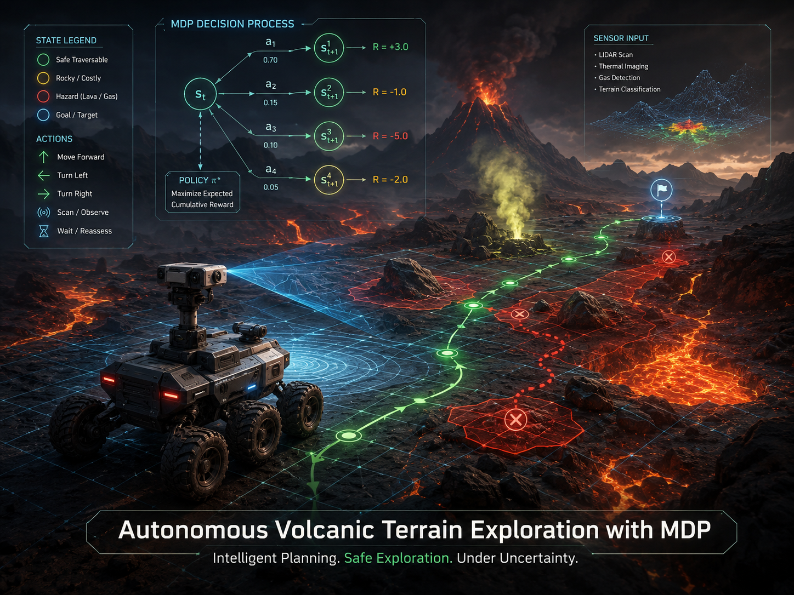
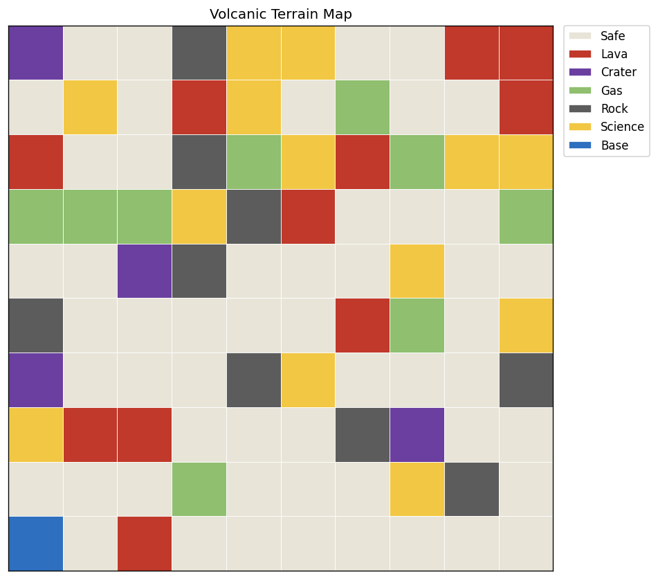
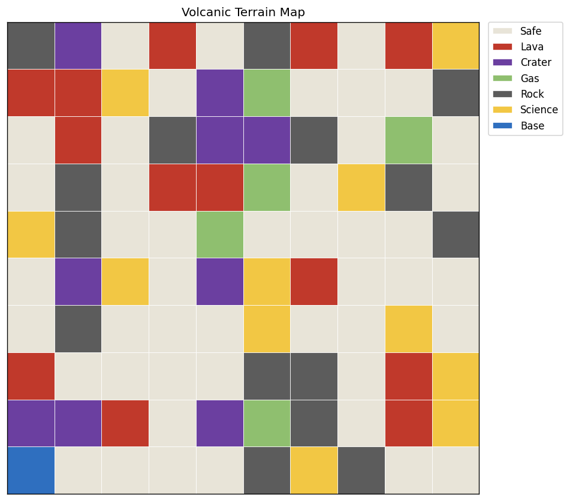
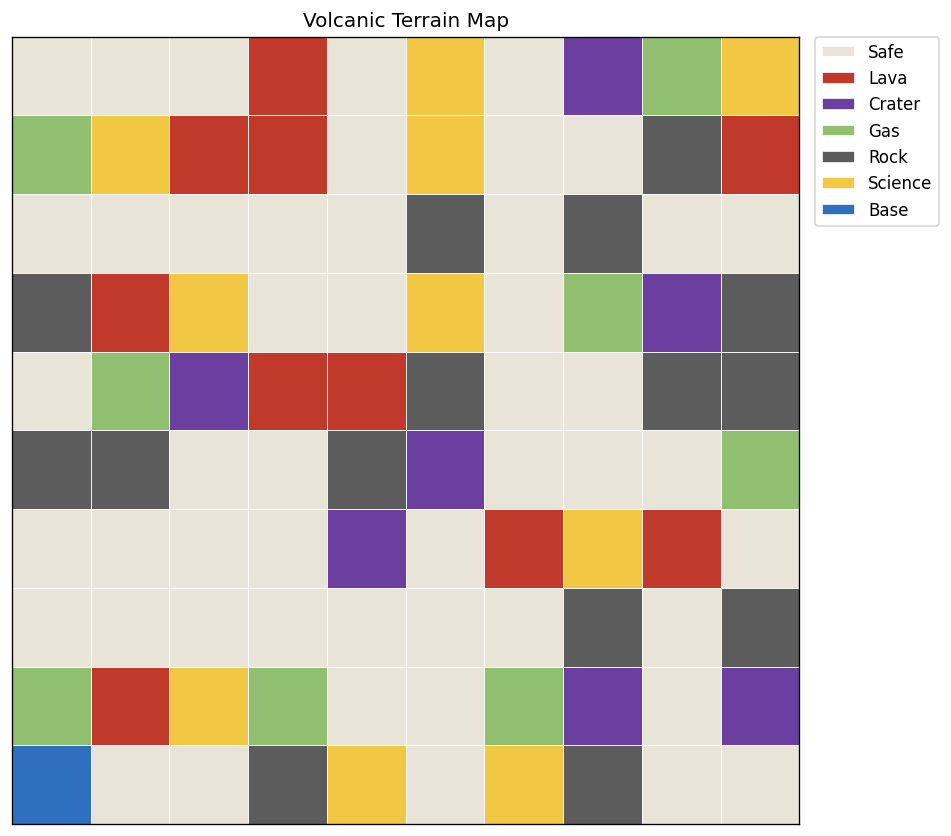
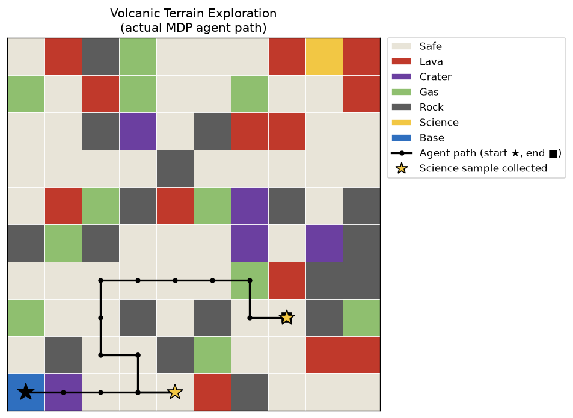
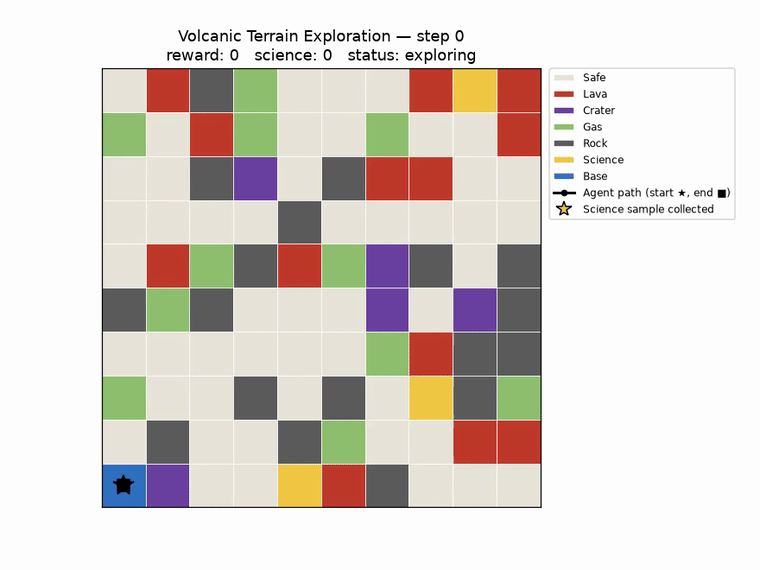
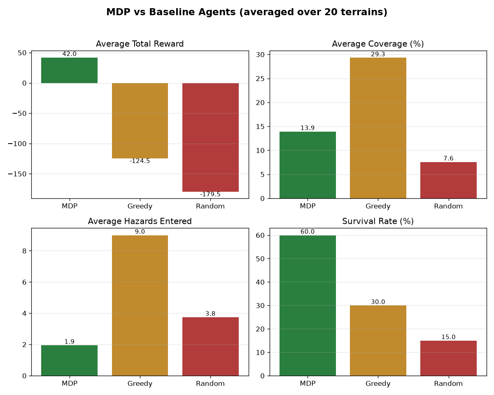

# Autonomous Volcanic Terrain Exploration Using Markov Decision Process (MDP)

## Project Information

| Item       | Details                             |
| ---------- | ----------------------------------- |
| Course     | CSE 440 — Artificial Intelligence |
| Section    | 1                                   |
| Group      | 5                                   |
| Instructor | Dr. Mohammad Shifat-E-Rabbi [MSRb]  |

## Team Members

| Member   | Name           | Primary Responsibility                                                                                   |
| -------- | -------------- | -------------------------------------------------------------------------------------------------------- |
| Member 1 | Shakil Ahmed   | Repository foundation, terrain generation, MDP core, value iteration, policy extraction, and integration |
| Member 2 | Fahim Foysal   | Autonomous agent and simulation                                                                          |
| Member 3 | Shefa Tabassum | Terrain visualization and demo outputs                                                                   |
| Member 4 | Tanvir Ahmed   | Experiments, baseline comparison, and performance analysis                                               |

## Short Overview

This repository is for a CSE 440 Artificial Intelligence semester project. The project studies how an autonomous exploration agent can navigate hazardous volcanic terrain using a Markov Decision Process (MDP).

<p align="center">
  
</p>

<p align="center">
  <em>Project poster for the autonomous volcanic terrain exploration system.</em>
</p>

The implementation is complete. It includes volcanic terrain generation, the core MDP model, value iteration, policy extraction, an MDP-based explorer agent with a collect-once science rule and on-line re-planning, dynamic hazards (drifting gas clouds and spreading lava flows), a simulation loop, terrain and mission-path visualization, an animated demo video, baseline comparison experiments, and the final report and presentation slides.

## Problem Statement

Volcanic environments are dangerous, uncertain, and difficult for humans to explore directly. An autonomous agent operating in this type of environment must make decisions while considering hazards such as lava flows, craters, gas-emission zones, and obstacles. At the same time, it should collect useful scientific information and remain connected to a base station when needed.

The problem is to design an AI-based exploration system that decides where the agent should move in a grid-based volcanic terrain while balancing safety, exploration, and scientific reward.

## Why MDP Is Suitable

A Markov Decision Process is suitable for this project because the agent must make sequential decisions under uncertainty. Each movement action may not always lead exactly where intended because of terrain difficulty or environmental instability.

An MDP provides a structured way to represent:

- the current state of the agent,
- the possible actions available to the agent,
- the probability of reaching the next state after an action,
- the reward or penalty for entering different terrain cells,
- and a policy that recommends the best action for each state.

## AI Formulation

### States

Each state represents the agent's position in the terrain grid as `(row, col)`. Rock cells are treated as obstacles and are excluded from the valid MDP state space.

### Actions

The current action set includes `UP`, `DOWN`, `LEFT`, `RIGHT`, `STAY`, and `SCAN`.

### Transition Probabilities

Transition probabilities model uncertainty in movement. The MDP uses intended movement, left slip, right slip, and stay probabilities. If a movement would go outside the grid or into a rock cell, the agent remains in the same state.

### Rewards

Rewards guide the agent's behavior. Science points and the base station provide positive rewards, while hazardous cells such as lava, craters, and gas zones provide penalties. Invalid blocked movement and scanning also have costs.

### Policy and Value Iteration

Value iteration estimates state values, and the resulting policy selects the best action for each valid state.

### Collect-Once Science Rule and Re-Planning

A science sample can only be collected once. When the agent first reaches a science cell, the sample is gathered, the cell becomes ordinary ground, and the agent re-runs value iteration so the policy targets the next objective instead of camping on one high-value cell.

### Dynamic Hazards

The environment changes while the agent explores (`support/hazards.py`): gas clouds can drift into a neighboring safe cell, and lava can spill into a neighboring safe cell and cool back to safe ground after a few steps. Only safe cells are ever converted, so the base, science points, rock, and craters are never destroyed and the MDP state space stays fixed. Whenever the terrain changes, the agent re-plans with a fresh round of value iteration — and a lava flow that reaches the agent's cell destroys it.

## Terrain Symbols

| Character | Meaning               |
| --------- | --------------------- |
| `.`       | Safe traversable cell |
| `L`       | Lava flow             |
| `C`       | Crater                |
| `G`       | Gas-emission zone     |
| `R`       | Rock or obstacle      |
| `S`       | Science point         |
| `B`       | Base station          |

## Repository Structure

```text
volcanic-mdp-explorer/
|-- main.py
|-- README.md
|-- requirements.txt
|-- .gitignore
|-- data/
|   |-- .gitkeep
|   |-- sample_terrain_seed_42.csv
|   `-- terrain_config.json
|-- images/
|   |-- poster.png
|   |-- final_map.png
|   |-- performance_plot.png
|   |-- demo_video.mp4
|   |-- demo_video.gif
|   |-- terrain_map_seed_1.png
|   |-- terrain_map_seed_7.png
|   `-- terrain_map_seed_23.png
|-- support/
|   |-- __init__.py
|   |-- config.py
|   |-- utils.py
|   |-- terrain.py
|   |-- mdp.py
|   |-- agent.py
|   |-- hazards.py
|   |-- simulation.py
|   |-- visualization.py
|   |-- demo_video.py
|   `-- experiments.py
|-- outputs/                  (generated locally, gitignored)
|   |-- .gitkeep
|   |-- experiment_results.csv
|   |-- final_map.png
|   |-- performance_plot.png
|   `-- demo_video.mp4
`-- others/
    |-- .gitkeep
    |-- final_report.md
    `-- presentation_slides.md
```

## Progress

Update 1 code from all four members was merged, and the final update completes the remaining roadmap items:

- Collect-once science rule with on-line re-planning built into the core agent (no more camping on one science cell)
- Dynamic hazards: drifting gas clouds and spreading/cooling lava flows, with re-planning after every terrain change
- The mission map now shows the real simulated agent path and collected samples
- `main.py` runs the full pipeline end to end
- Animated demo video generation
- Final report and presentation slides in `others/`

### Member 1 — MDP Core

- Repository and project structure
- Configuration system
- Volcanic terrain generator
- State and action definitions
- Reward model
- Stochastic transition model
- Value iteration
- Optimal policy extraction

### Member 2 — Agent and Simulation

- `MDPExplorerAgent`
- BASE-position initialization
- Policy-based action selection
- Stochastic movement
- Path and visited-cell tracking
- Reward, hazard, science-point, and survival tracking
- Mission summary and simulation loop

### Member 3 — Visualization

- Matplotlib-based terrain rendering
- Distinct colors for all seven terrain types
- Map title and legend
- Saved visualization output
- Terrain examples generated with different random seeds

### Member 4 — Experiments

- MDP, random, and greedy comparison structure
- Shared experiment metrics
- CSV results generation
- Performance-plot generation

## Generated Results and Visuals

### Terrain Visualization

`support/visualization.py` renders the terrain grid with matplotlib, using a distinct color for each of the seven cell types—Safe, Lava, Crater, Gas, Rock, Science, and Base—together with a title and legend. The following examples were generated using different random seeds.

<table>
  <tr>
    <td align="center">
      <br>
      <sub>Terrain Example 1</sub>
    </td>
    <td align="center">
      <br>
      <sub>Terrain Example 2</sub>
    </td>
    <td align="center">
      <br>
      <sub>Terrain Example 3</sub>
    </td>
  </tr>
</table>

### Exploration Map

<p align="center">
  
</p>

<p align="center">
  <em>Actual simulation result (seed 42, dynamic hazards on): the solid route is the real path taken by the MDP explorer agent (start ★ at BASE, end ■), and gold stars mark the cells where science samples were collected.</em>
</p>

### Mission Demo Video

<p align="center">
  
</p>

<p align="center">
  <em>A full mission under dynamic hazards: the terrain changes (gas drifts, lava spreads and cools) while the agent explores, collects samples, and re-plans. An MP4 copy is at <a href="images/demo_video.mp4">images/demo_video.mp4</a>.</em>
</p>

### Performance Comparison

<p align="center">
  
</p>

<p align="center">
  <em>MDP vs Greedy vs Random averaged over 20 random terrains. The MDP agent is the only one with positive average reward, and it survives twice as often as the greedy baseline while entering roughly one-fifth as many hazards.</em>
</p>

## Requirements

Install the project dependencies with:

```bash
pip install -r requirements.txt
```

The dependency list includes:

- `numpy`
- `matplotlib`
- `pandas`

Generating `outputs/demo_video.mp4` also uses the `ffmpeg` command-line tool if it is installed; without it, the demo script saves a GIF instead.

## How to Run

Run the full pipeline (terrain → MDP → agent simulation → mission map), with dynamic hazards on by default:

```bash
python main.py
```

Optional arguments:

```bash
python main.py --seed 10             # different terrain
python main.py --size 20             # 20x20 grid
python main.py --static              # disable dynamic hazards
python main.py --steps 200           # longer step budget
```

Individual module demos:

```bash
python support/mdp.py                # MDP core: value iteration and policy grid
python support/agent.py              # short agent rollout
python support/simulation.py         # simulation loop, static and dynamic runs
python support/hazards.py            # watch the terrain evolve for 20 steps
python support/visualization.py      # render the mission map with the real path
python support/demo_video.py         # generate outputs/demo_video.mp4
python support/experiments.py        # MDP vs Random vs Greedy comparison
```

## Known Limitations and Future Work

- Movement noise and hazard dynamics use fixed hand-chosen probabilities; they could be learned or made configurable.
- The MDP state is position-only; adding energy or remaining-science to the state would let the planner reason about them exactly instead of via re-planning.
- The agent is risk-neutral; a risk-sensitive objective could raise the survival rate further.
- The `SCAN` action is priced but rarely useful; a fog-of-war POMDP extension would give it a real role.

## Development Roadmap

- Week 1: Planning and repository setup. ✅
- Week 2: Terrain generator. ✅
- Week 3: MDP formulation and value iteration. ✅
- Week 4: Agent simulation and dynamic hazards. ✅
- Week 5: Visualization and comparison experiments. ✅
- Week 6: Demo, report, slides, and final polish. ✅

## Generated Outputs

Running the commands above regenerates every artifact locally in `outputs/` (gitignored):

- `outputs/experiment_results.csv`
- `outputs/performance_plot.png`
- `outputs/final_map.png`
- `outputs/demo_video.mp4`

Committed copies of the final visuals live in `images/`, and the final report and presentation slides live in `others/`.
